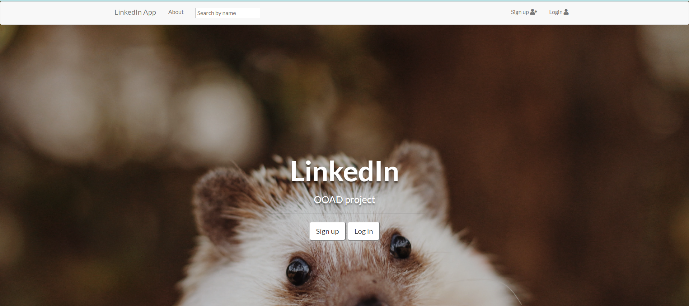
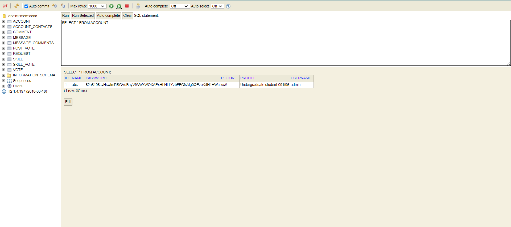

# LinkedIn Application
## OOAD Project
This is a Java Spring project based on designing a LinkedIn application using Object Oriented Approach and implemented it using JAVA that supports MVC Architectural Pattern.
Project entails a full-stack web application where the user may register and log in to the service where they can create themselves a professional portfolio. User can invite other users to their contact network and praise their skills.

Project is built with Java Spring framework, Thymeleaf, HTML and Bootstrap CSS.

 

## Service functionalities
* Users may register to the service and log in and out to the service
* User has their own profile where they may add a profile picture and list skills for other users to see - like a small resume
* Logged in user can vote any one other user’s skill. User’s skill can be voted only once by the same user.
* Logged in user may ask another user to become their contact from this user’s profile page. A request is sent and when this request is accepted these two users become contacts.
* Unlogged user may only view profiles and search them by users full name.
* Logged in user can post content in the message board. Content will be show to all contacts the user has.
* Contacts may comment and like each others' posts.

## Installation and starting the server
From terminal run the application by running the command
`mvn spring-boot:run`. ALternatively it can be run on IntelliJ or another IDE.

To start the server find the file [MyApplication.java](src/main/java/projekti/MyApplication.java) and run the file. Application starts at `http://localhost:8080/`.

## Database
Below is a picture of the H2 database structure.
It can be viewed on opening up `http://localhost:8080/h2-console` after the application starts. 

### `/documentation` contains [images](documentation/Images/) and [project report](documentation/OOAD%20Project%20Report%20-%20LinkedIn.pdf).
